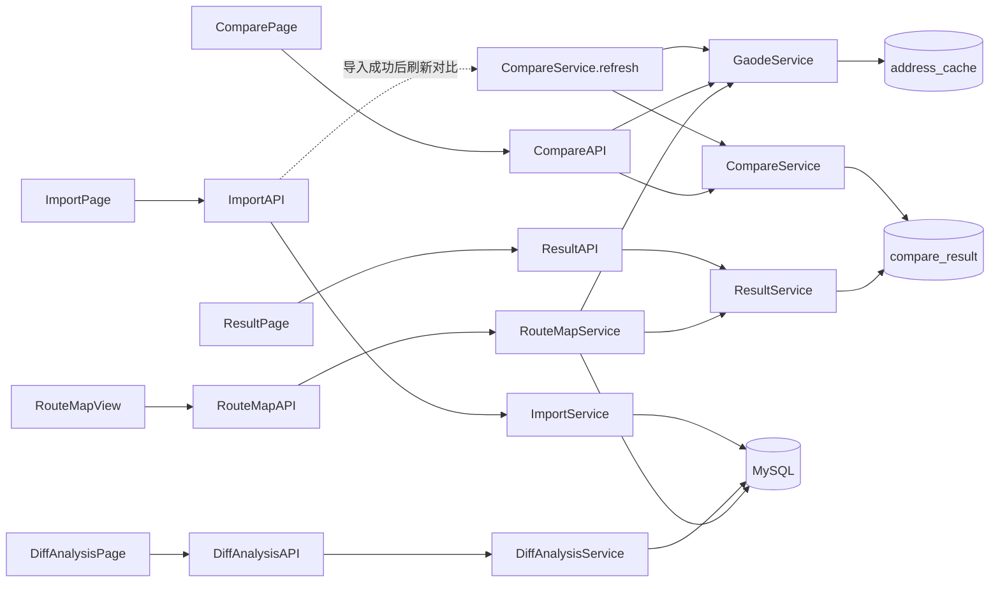
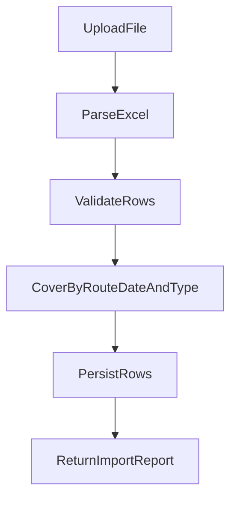
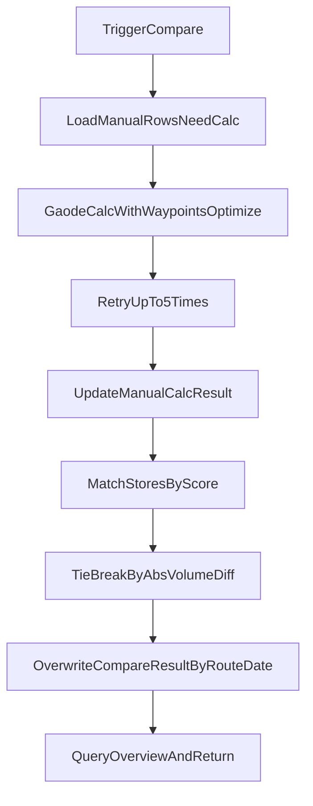

# 货车智能装载及运输排线 - 研发开发设计文档（融合增补版）

**文档版本**：V1.2（在 V1.1 基础上增补）  
**对应 PRD**：`docs/智能排线PRD_详细版_V1.1.md`（§12 为 V1.2 与实现对齐的增补）  
**文档目标**：将 PRD 规则转化为可开发、可测试、可发布的工程实现方案

---

## 1. 设计原则与边界

- 与 PRD 保持同口径：`route_date` 分桶、同日匹配、覆盖策略一致。
- 先保证可用性，再做高阶优化（MVP 优先）。
- 数据层支持部分成功，不采用大事务阻断全链路。
- 规则明确可追溯：匹配过程可复盘，失败原因可定位。

---

## 2. 技术架构

### 2.1 技术栈
- 后端：Python 3.9+、FastAPI、SQLAlchemy、openpyxl
- 前端：Web 页面（当前为轻量实现，可平滑升级 React/Vue）
- 数据库：MySQL（本地开发可用 SQLite）
- 第三方：高德地图地理编码与驾车路径规划 API

### 2.2 架构总览



---

## 3. 领域模型与数据口径

### 3.1 关键实体
- `sys_suggest`：系统建议排线主数据
- `manual_route`：手动排线主数据（含补算状态）
- `address_cache`：地址坐标缓存
- `compare_result`：比对结果快照

### 3.2 字段口径（与 PRD 对齐）
- `route_date`：业务排线日（`DATE`，`YYYY-MM-DD`）
- `stores`：逗号分隔门店集合
- `match_status`：`full` / `partial` / `none`
- `match_score`：匹配度（建议增加原始 0~1 值）
- `volume_diff`：`系统体积 - 手动体积`（手动体积为 0 时置空）
- 不展示 `load_rate`（仅留存数据层）

### 3.3 当前库表升级建议
1. `compare_result.volume_diff_rate` 重命名为 `volume_diff`。  
2. 新增 `compare_result.match_score`（便于排序和审计）。  
3. 可选新增 `manual_calc_failure_log`（记录失败门店与重试信息）。

### 3.4 路线地图相关字段（与 PRD §6.6、§9.1 对齐）

| 表 | 字段 | 类型 | 说明 |
|----|------|------|------|
| `sys_suggest` | `route_polyline` | MEDIUMTEXT NULL | 道路级折线，与驾车路径规划结果一致；编码格式见 §5.5 |
| `manual_route` | `route_polyline` | MEDIUMTEXT NULL | 补算成功时写入；与 `est_distance`/`est_duration` 同源规划 |

**写入时机（建议）**

- **手工**：`GaodeService` 在驾车路径规划成功并写回里程、时效时，**同步写入** `route_polyline`；失败或部分成功则不写或清空，与 `calc_status` 一致。  
- **系统**：导入数据一般不含折线。可选策略（二选一或组合，实现阶段定稿）：  
  - **A**：比对前/首次打开地图时，对系统侧按「仓库 + `stores` 顺序」调用与手工相同的规划策略，计算后**回写** `sys_suggest.route_polyline`（便于重复打开地图不再打高德）。  
  - **B**：仅在 `GET /api/compare/route-map/{compare_result_id}` 内按需计算，不持久化（实现简单、重复请求成本高）。  

**推荐默认**：手工必落库；系统采用 **A** 回写，与验收 M-07「道路轨迹」及性能一致。

---

## 4. 核心模块设计

## 4.1 导入模块（ImportService）

**职责**
- 解析系统/手动 Excel。
- 字段校验、数据校验、行级错误收集。
- 按 `route_date + dataset_type` 覆盖。

**覆盖策略（已定）**
- 同 `route_date` + 同数据类型整批覆盖。
- 覆盖目标范围，不清空整库。

**返回结构**  
- `total_rows`、`success_rows`、`failed_rows`、`errors[]`  
- 可选（实现已包含）：`touched_route_dates`（本批成功行涉及的排线日，ISO 日期去重升序）、`compare_refresh`（见 **§4.1.1** / **§14.2**）。  
- `same_day_deactivated`：当日本批未包含的历史有效行被软失效条数，见 PRD §11.1 与 `api-contract`。

### 4.1.1 导入成功后排线对比刷新（`CompareService` + 路由层）

- **触发条件**：`success_rows > 0` 且能解析出本批涉及的 **排线日集合** `touched_route_dates`（非空）。  
- **实现要点**（与代码 `compare_service.refresh_compare_after_import` 一致）：  
  1. 以 `min(touched) … max(touched)` 为闭区间，调用 `gaode_service.backfill_manual_routes_by_date_window`（或项目中等价函数），对区间内有效 `manual_route` 做高德补算。  
  2. 对 `touched_route_dates` 中**每一个**不重复日期调用 `run_compare`（与 `POST /api/compare/run` 单日逻辑同源），覆盖该日 `compare_result`。  
- **响应字段**：`compare_refresh` 中可含补算结果摘要、实际执行比对的日期数、落库行数等；异常时允许 `{ "error": "…" }` 便于联调。  
- **与手动比对的关系**：不替代用户在前端对**任意**闭区间触发的全量 `POST /compare/run`；导入刷新仅保证**所涉日**在后台与主数据表同步。

## 4.2 高德补算模块（GaodeService）

**职责**
- 对手动排线缺失里程/时效记录执行补算。
- 使用途经点优化计算配送路径。
- 失败重试最多 5 次，输出失败门店。

**处理策略**
- 非全局事务：单条成功即落库，单条失败可继续后续。
- 缓存优先：地址先查 `address_cache`，未命中再请求高德。

**折线输出（地图联动）**
- 路径规划 API 返回的步骤/路径折线须**规范化**为统一格式后写入 `manual_route.route_polyline`（及后续扩展的 `sys_suggest.route_polyline`）。  
- 规范建议：存 **高德 `polyline` 编码字符串**（多段可顺序拼接，或存 JSON：`{"encoding":"amap_polyline_v1","parts":["..."]}`），前后端约定同一解码方式（高德 JS API 2.0 或后端解码为 `[[lng,lat],...]` 再返回，二选一写入 §5.5）。

## 4.3 比对模块（CompareService）

**职责**
- 在同 `route_date` 内执行系统与手动配对。
- 根据规则计算匹配状态和差异指标。
- 覆盖写入 `compare_result`。

**匹配算法**
1. 按 `route_date` 读取 S（系统）和 M（手动）集合。
2. 逐条计算 `match_score = |S∩M| / max(|S|,|M|)`。
3. 选最高分唯一配对。
4. 并列最高分时，按 `abs(系统体积 - 手动体积)` 最小优先。
5. 输出 `full/partial/none`、`volume_diff`、线路/里程/时效差异。

## 4.4 结果模块（ResultService）

**职责**
- 聚合统计（概览卡片）。
- 条件筛选（日期、匹配状态）。
- CSV 导出（明细结果）。
- 为路线地图接口提供按 `compare_result_id` 解析 `sys_id` / `manual_id` 及运单等展示字段（可内聚在 `RouteMapService` 中调用仓储）。

## 4.5 路线地图模块（RouteMapService）

**职责**
- 根据 `compare_result.id` 定位本行比对记录，加载关联的 `sys_suggest` / `manual_route`（允许一侧 `NULL`，与未匹配、单侧数据一致）。  
- 组装**地图专用 DTO**：两侧是否可展示、`polyline`、有序途经点（仓库 + 门店序列）、与 PRD 一致的摘要字段。  
- **缺失折线**：若某侧 `route_polyline` 为空但地理编码可用，调用 `GaodeService` 同步规划并可选回写库（与 §3.4 策略 A 一致）。  
- **不绘制**：某侧无有效仓库/门店或规划最终失败时，`available=false`，前端按 PRD M-05 仅绘制另一侧。

**前端**
- 嵌入**高德 JS API 2.0**（或团队选定版本），使用** Web 端 Key**（与后端 REST Key 分离；域名白名单按环境配置）。  
- 折线为道路贴合轨迹：使用接口返回的折线或解码后 `LngLat[]` 绘制，**禁止**仅用 Marker 直线连线作为最终效果。  
- 样式：系统 `#1677FF`（蓝）、手工 `#FF4D4F`（红）；重叠时使用 PRD §6.6 的透明度/线型/图层开关组合。

## 4.6 差异分析模块（`DiffAnalysisService`）

**代码位置**：`app/services/diff_analysis_service.py`；入口 API：`app/api/routes.py` 中 `GET /api/diff-analysis/multi-vehicle-stores`。

**职责概要**
- 输入：`route_date_from`、`route_date_to`（闭区间）、`dataset_type`（`all` | `system` | `manual`）、可选 `warehouse_name`。  
- 输出聚合：  
  - `items`：一店多车明细（**全部** 时系统/手工**分侧**判定一店多车、不混算运单；单侧时仅看该侧）。  
  - `vehicle_diff`：按**车型**统计系统/手工**运单数**及差异（**不受** `dataset_type` 再过滤，与 PRD 一致）。  
  - `store_diff`：区间与仓库下拼载门店去重后的系统数、手工数、差值，及 **`only_in_system` / `only_in_manual`** 对称差店名列表（升序，供「门店差异列表」展示）。  
  - `trend_by_day`：一店多车视角下，逐日系统/手工 **「多车店」的门店个数**（柱图数据）。  
  - `warehouse_options`：当前筛选日期范围内有效行中的始发仓去重，供前端下拉。  
- **`vehicle_store_trend_by_day`（若仍在响应中）**：按日运单数与去重门店数四序列，**当前前端不展示**双轴折线图；保留与否由后端版本决定，产品默认见 PRD §12.4。

**测试**：`tests/test_diff_analysis_service.py` 覆盖车辆差异、门店对称差、一店多车分侧与日期区间等。

## 4.7 基础数据（可选模块）

- **门店主数据 / 仓店距离**：`store_master_service`、导入脚本与约定模板一致；供坐标解析、距离展示与排线数据对齐。  
- **客户列表导入**：`customer_list_import` 等在业务启用时将客户/收货点资料与 `store_coordinate` 等表联动，与排线导入流程解耦。

---

## 5. 接口设计

### 5.1 导入接口
- `POST /api/import/{dataset_type}`
- `dataset_type`: `system | manual`
- 上传文件：`multipart/form-data`

### 5.2 比对执行接口
- `POST /api/compare/run`
- 入参：`route_date_from`、`route_date_to`（闭区间，可同日；与实现一致）
- 行为：在区间内对手动行做补算后按日比对，结果覆盖

### 5.3 结果查询接口
- `GET /api/compare/overview?route_date=...`
- `GET /api/compare/results?route_date=...&match_status=...`

### 5.4 结果导出接口
- `GET /api/compare/export?route_date=...`

### 5.5 路线地图接口（单行）

- `GET /api/compare/route-map/{compare_result_id}`
- **路径参数**：`compare_result_id` 为表 `compare_result.id`（整数），与结果列表每行一一对应。
- **成功响应**（JSON）：须满足 PRD §9.1 M-04～M-10 的数据需要；建议结构如下（字段可扩展，核心语义不变）：

```json
{
  "route_date": "2026-04-20",
  "match_status": "full",
  "sys_waybill_no": "SYS001",
  "manual_waybill_no": "MAN001",
  "warehouse_name": "仓库1",
  "system": {
    "available": true,
    "polyline": "高德polyline编码或null",
    "path": [[116.1, 39.9], [116.2, 39.95]],
    "markers": [
      {"seq": 0, "name": "仓库1", "lng": 116.1, "lat": 39.9, "kind": "warehouse"},
      {"seq": 1, "name": "门店甲", "lng": 116.11, "lat": 39.91, "kind": "store"}
    ]
  },
  "manual": {
    "available": true,
    "polyline": null,
    "path": [[116.1, 39.9], [116.12, 39.92]],
    "markers": []
  },
  "style": {
    "system_line_color": "#1677FF",
    "manual_line_color": "#FF4D4F"
  }
}
```

**字段约定**

| 字段 | 说明 |
|------|------|
| `system` / `manual` | 单侧对象；`available=false` 时 `polyline`/`path`/`markers` 可为空，前端不绘制该侧 |
| `polyline` | 可选；与库表 `route_polyline` 一致；若仅返回 `path` 则前端可直接画折线 |
| `path` | 可选；已解码的 `[[lng,lat], ...]`，与道路规划一致；与 `polyline` 二选一或同时提供（同时提供时优先 `path` 降低前端依赖） |
| `markers` | 有序途经点，**seq 与配送顺序一致**，用于序号标注与验收 M-10 |

- **错误**：`compare_result_id` 不存在 → `404` 或业务错误码 `NOT_FOUND`；参数非法 → `BAD_REQUEST`。

### 5.6 差异分析（一店多车 / 车辆差异 / 门店差异）

- `GET /api/diff-analysis/multi-vehicle-stores?route_date_from=…&route_date_to=…&dataset_type=all|system|manual`  
- 可选查询参数：`warehouse_name`（精确匹配始发仓）。  
- 成功响应为 JSON 对象，含 `items`、`vehicle_diff`、`store_diff`、`trend_by_day`、`warehouse_options` 等，字段语义见 **§4.6** 与 `docs/api-contract.md`。  
- `from > to` 或参数非法时返回 **400**。

### 5.7 错误码建议（沿用）
- `BAD_REQUEST`
- `IMPORT_VALIDATION_FAILED`
- `GAODE_CALC_FAILED`
- `COMPARE_EXECUTE_FAILED`
- `NOT_FOUND`：`compare_result` 或关联主数据不存在（路线地图接口）

---

## 6. 关键流程

### 6.1 导入流程



- **补充**：`persistRows` 成功后，若满足 **§4.1.1** 条件，则在返回前执行「所涉日补算 + 按日比对」，响应中附带 `touched_route_dates`、`compare_refresh`。

### 6.2 比对流程



---

## 7. 异常与容错

### 7.1 导入
- 缺失关键列：整批驳回并返回错误。
- 行级错误：跳过错误行，其余有效行入库。

### 7.2 高德补算
- 超时/限流/请求失败：单条最大重试 5 次。
- 失败后保留失败状态，并返回失败门店列表。
- 不影响其他记录继续执行。

### 7.3 比对执行
- 数据缺失（某侧无数据）：返回空结果或提示无可比数据。
- 手动体积为 0：`volume_diff` 置空，避免异常值污染。

---

## 8. 前端交互实现要点

- 导入页：增加“覆盖导入”提示文案（范围是当日同批软失效+更新策略）；说明成功导入后会在后台对**所涉排线日**重算补算与排线对比；数据明细分页查询同 `api-contract`。
- 比对页：展示补算中、补算成功、补算失败（含失败门店）；闭区间与仓库等筛选与后端一致。
- 排线差异（结果）页：去除装载率，保留匹配度与差异指标，扩展门店/车型类列；**明细表每行**地图入口；**导入成功且当前在该页**时，用 **GET** 重新拉取 overview/results 刷新，一般不再重复 `POST /compare/run`（与 §4.1.1 配合）。
- 差异分析页：一次请求拉取 §5.6 结构；**导入成功后**若停留该页，重新请求同一分析接口以与主数据表对齐；一店多车柱图与车辆/门店块随响应展示；不渲染「运单与门店四线日趋势」图（PRD §12.4）。
- 路线地图页：双线图层、图例、重叠可读性处理；未匹配行同等入口（PRD §6.5、§9.1）。
- 导出：导出当前筛选结果或默认当前日期全量结果。

---

## 9. 测试方案

### 9.1 单元测试
- 门店集合解析与匹配度计算。
- 并列打散策略（体积差绝对值最小）。
- `volume_diff` 边界（手动体积为 0）。
- 差异分析：`store_diff` 对称差列表、`vehicle_diff` 分车型、一店多车 `all` 与单侧规则（`test_diff_analysis_service`）。

### 9.2 集成测试
- 导入 -> 补算 -> 比对 -> 查询 -> 导出闭环。
- 覆盖导入（同日同类型）验证。
- 比对覆盖（区间重跑）验证；导入后 `compare_refresh` 所涉日 `compare_result` 更新（按环境手工或自动验收）。
- 高德失败重试 5 次与失败门店返回验证。
- 路线地图：`GET /api/compare/route-map/{id}` 在完全匹配 / 部分匹配 / 未匹配、单侧缺失场景下响应与绘制符合 PRD §9.1（可与人工抽验折线非直线）。
- 差异分析：`GET /api/diff-analysis/multi-vehicle-stores` 与筛选条件一致性。

### 9.3 回归测试
- 不同日期数据隔离正确性。
- 500 条数据批处理稳定性。

---

## 10. 开发任务拆解

### 10.1 后端任务
1. 导入覆盖逻辑落地（同日同类型）。
2. 高德补算重试与失败门店记录落地。
3. 比对算法并列规则落地。
4. 结果字段 `volume_diff` 口径落地。
5. `sys_suggest` / `manual_route` 增加 `route_polyline` 及补算/按需规划写回；实现 `RouteMapService` 与 §5.5 接口。

### 10.2 前端任务
1. 导入页覆盖提示与错误明细展示。
2. 比对页补算状态与失败门店展示。
3. 结果页字段与口径同步（去装载率）。
4. 导出联动筛选条件。
5. 结果行地图入口、高德 JS API 双轨迹绘制、图例与重叠样式（PRD §6.6、§9.1）。

### 10.3 测试任务
1. 补齐规则变更相关自动化用例。
2. 编写覆盖与重跑回归清单。
3. 产出上线前冒烟脚本。

---

## 11. Git 与发布规范

- 分支：`main`（生产）、`dev`（集成）、`feat-xxx`、`fix-xxx`
- 提交信息：`feat/fix/style/refactor/docs/chore/test: 描述`
- 标准流程：`dev` 拉分支开发 -> 合并回 `dev` -> 验证通过后合并 `main`

---

## 12. V1.0 -> V1.1 技术变更记录

### 12.1 领域规则对齐
- 增加 `route_date` 技术定义与同日匹配边界。
- 匹配算法改为“重合门店数 / 最大门店数”。
- 配对策略明确为“最高匹配度唯一配对 + 体积差绝对值并列打散”。

### 12.2 指标与字段调整
- 结果指标由 `volume_diff_rate` 迁移为 `volume_diff`。
- 增补手动体积为 0 的空值处理策略。
- 明确结果展示层移除装载率字段。

### 12.3 任务流程调整
- 高德补算流程增加“途经点优化”约束。
- 高德异常处理明确“最多重试 5 次”。
- 失败记录粒度下沉到失败门店，支持部分成功。

### 12.4 数据覆盖策略调整
- 导入实现按“同日期+同类型”覆盖，不清空整库。
- 比对结果按“同日期”重跑覆盖，确保最新结果可追踪。

### 12.5 路线地图（增补）
- 新增 `route_polyline` 字段与 `RouteMapService`、§5.5 查询接口；高德规划结果与地图轨迹同源。
- 验收对照 PRD §9.1（M-01～M-10）。

---

## 13. V1.2 开发决议附录（已确认）

### 13.1 规则固化
- 导入覆盖采用软失效（`is_active`），不做物理删除。
- 并列匹配按三层规则：匹配度 > 体积差绝对值 > 手动运单号字典序。
- 高德失败门店采用结构化记录与返回：`[{store, reason, retry_count}]`。
- 导出默认当前筛选结果。
- 数据管理页 MVP 不支持编辑删除，仅查看与导出。

### 13.2 审计落地范围
- 导入审计日志。
- 比对触发审计日志。
- 高德补算失败明细日志。

### 13.3 改造优先级建议
1. 数据库结构升级（新增字段与日志表）。
2. 导入/比对服务改造（覆盖与并列规则）。
3. 高德失败明细与接口返回改造。
4. 前端展示与导出口径同步。
5. 路线地图：`route_polyline` 落库、`/api/compare/route-map/{id}`、前端地图页（见 §3.4、§4.5、§5.5）。
6. 测试用例补齐并回归。

---

## 14. V1.2 工程实现增补（与 PRD §12 对照）

本清单用于研发与产品对齐「已落地」范围，详细字段仍以 `docs/api-contract.md` 为准。

| 能力 | 后端要点 | 前端要点 |
|------|----------|----------|
| 导入后对比刷新 | `import` 成功 → `refresh_compare_after_import`：区间补算 + 所涉日 `run_compare`；返回 `touched_route_dates`、`compare_refresh` | 排线差异页：`GET` overview/results 刷新；不上来再 `POST /compare/run`（除非用户主动全区间查询） |
| 差异分析 | `DiffAnalysisService.list_multi_vehicle_stores` 聚合 `items` / `vehicle_diff` / `store_diff`（含对称差列表）/ `trend_by_day` / `warehouse_options` | 单页拉取 §5.6；导入成功后若在本页则重新查询；不展示运单+门店四线日趋势图 |
| 排线差异扩展列 | `ResultService` / 比对结果 DTO 含门店、车型、分侧差异等（与 `compare_result` 及 join 一致） | 表格列、排序与地图入口；与 PRD §6.5 扩展说明一致 |
| 基础数据 | `store_master_service`、客户列表导入等独立模块 | 仓店距离、客户基础数据等独立路由页 |

**配置与契约**：环境变量、高德 Key、MySQL 连接等仍按部署文档；对外 JSON 形状以 `api-contract` 为权威说明，避免 PRD/研发/实现三处漂移。

**已明确不交付的 UI**：双纵轴「运单与门店」日趋势折线图不在前端渲染；若接口仍返回 `vehicle_store_trend_by_day`，视为可选/兼容字段，不作为验收项。

